# DBProject_0939_2584
## Moshe Goodman 770120939  
## Yehuda Copperman

### about the project


the __project__ of the whole class is to run a gym chain  
this **sub-project** will be managing all the workers within the system which would include all the data and access to the data of the people.  
the data includes personal data, salary, seniority, bunus, contract, and profession/ job.


**person**(**pId**,date of birth, first_name, last_name, email,address, phone)  
* **freelance**(**pId**)  
    * **worker**(**pId**,job_title,contract,hire_date)  
        * **hourly**(**pId**,Hourly_wage,bonus,overtime_rate)  
        * **monthly**(**pId**,vacation_days,monthly_wage,benefits_package)  
* **timespan**(**date**,checkin_time,checkout_time)  
* **services**(**service_name**,equipmant_required)

* **shift**(**pid**,**date**)  
* **serves**(service_nme,pId, service_date_begin,service_date_complete,contract,price)


 
we might wanna add also tax and pension plans to the tables  
maybe it is better to combine the shift and timespan into one table (put into consideration whether you want to have workers clock in twice for the same time)  
we created the ERD and relational schema as shown in the pictures below  


    
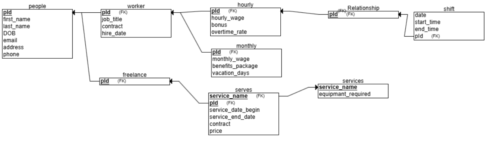    


here are three ways where we added data to the tables
1. python copying from shift.csv file using postgres command  
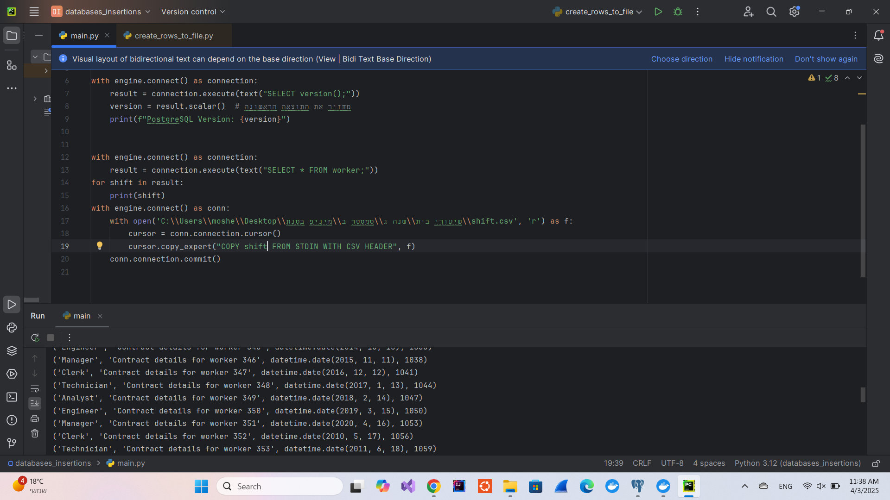      
3. python using pandas library
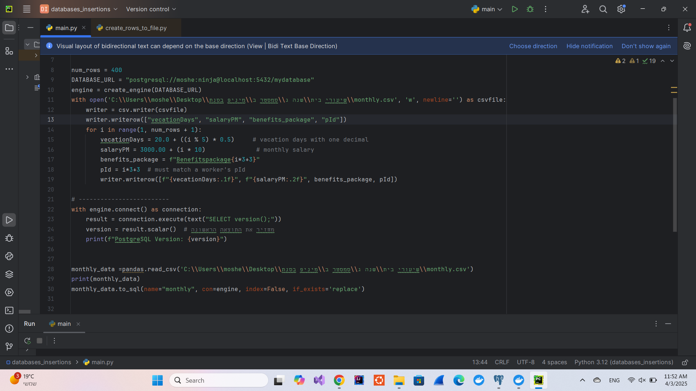      
5. using the pgadmin interface (pressing the import button.png)    
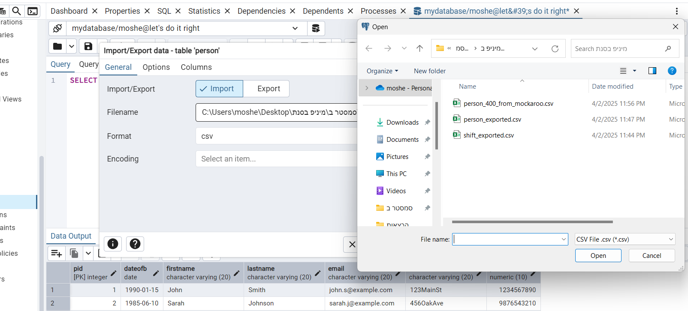      
6. using the query tool in pgadmin  
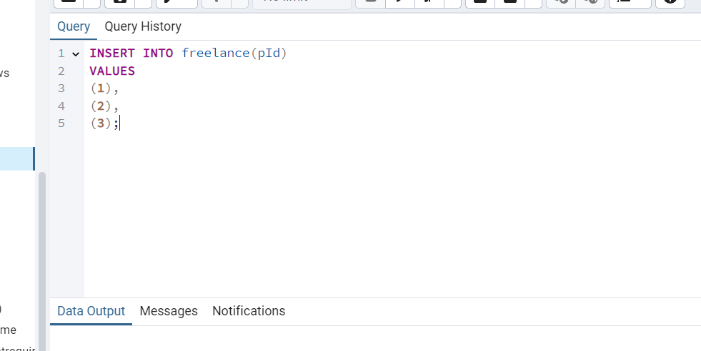      


below is the picture of the backup and restoration    
  
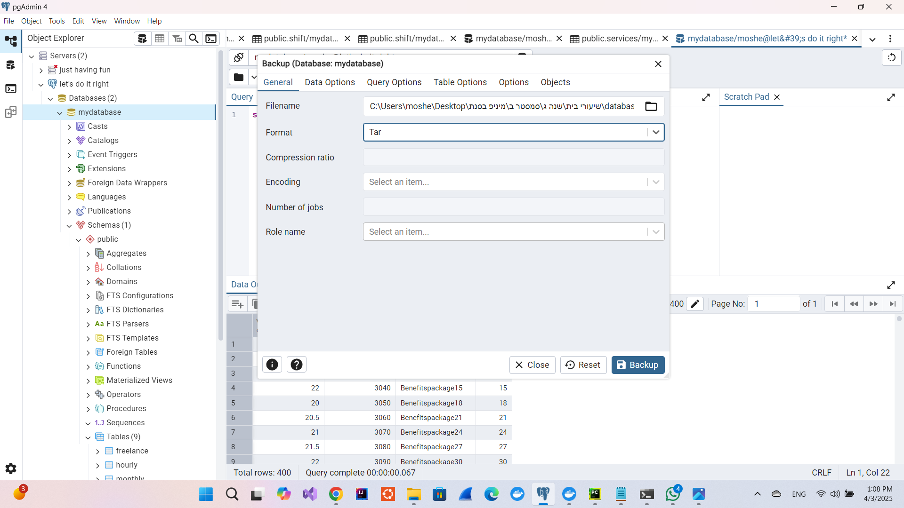      
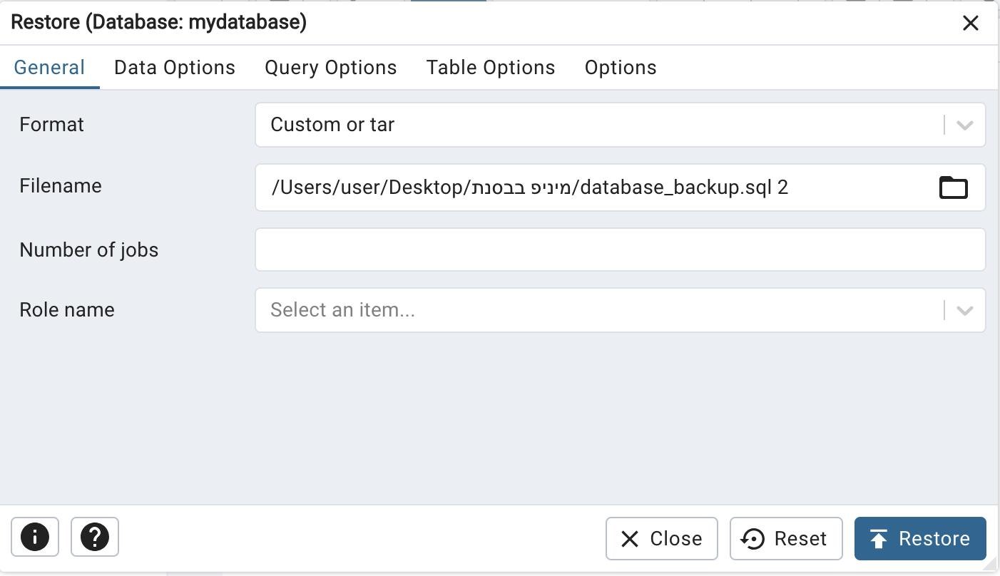      


# שלב 2
### שאילתא 1
**תיאור**: השאילתא מראה את שעות העבודה של כל עובד והתשלום שמקבל בחודש נתון  
**הקוד** : 
```
SELECT firstname,lastname,sum(hours_worked) as total_hours
FROM person NATURAL JOIN  (
    SELECT  pid,date,
            (EXTRACT(EPOCH FROM (clock_out - clock_in))) / 3600 AS hours_worked
    FROM    shift
	)as time_worked
WHERE EXTRACT(MONTH FROM date)  =3 and EXTRACT(year FROM date) =2022
GROUP BY pid
ORDER   BY total_hours DESC;
```
**התוצאה** :  
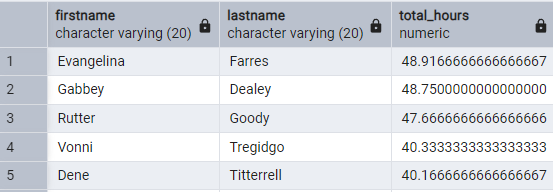


### שאילתא 2

**תיאור**: השאילתא מראה השכר עבור משמרת אחת  
**הקוד** : 
```
WITH shift_durations AS (
    SELECT  s.pid,
            s.date,
            EXTRACT(EPOCH FROM (s.clock_out - s.clock_in)) / 3600 AS hours_worked
    FROM    shift AS s
),
pay_calc AS (
    SELECT  d.pid,
            d.date,
            d.hours_worked,
            h.salaryph,
            h.bonus,
            d.hours_worked * h.salaryph                                AS base_salary,
            GREATEST(d.hours_worked - 8, 0) * h.salaryph * (h.overtimerate-1) AS extra_payment
    FROM    shift_durations d
    JOIN    hourly h USING (pid)
)
SELECT  p.pid,
        p.firstname,
        p.lastname,
        c.date,
		c.salaryph,
		ROUND(c.hours_worked,2)AS hours_worked,
        ROUND(c.base_salary, 2)      AS base_salary,
        ROUND(c.extra_payment, 2)    AS extra_payment_for_bonus
FROM    pay_calc   c
JOIN    person     p USING (pid)
ORDER   BY p.pid, c.date;
```
**התוצאה** :  
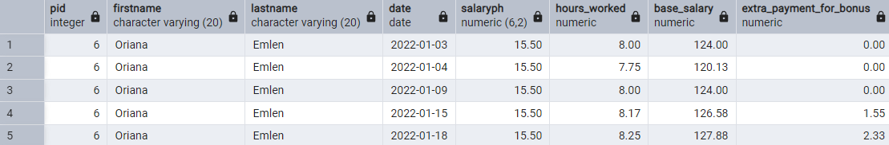

### שאילתא 3
**תיאור**: השאילתא מראה עבור עובד מסוים את כל המשכורות החודשיות שלו  
**הקוד** : 
```
SELECT pid,firstname, lastname,extract(YEAR FROM date )AS year,extract(MONTH FROM date )AS MONTH,SUM((EXTRACT(EPOCH FROM (clock_out - clock_in)) / 3600)*salaryph) as base_salary_month,SUM(GREATEST((EXTRACT(EPOCH FROM (clock_out - clock_in)) / 3600)-8,0)*salaryph*(overtimerate-1)) as extra_payment_for_bonus ,max(bonus)as bonus
FROM person NATURAL JOIN shift NATURAL JOIN hourly 
where pid=300
GROUP BY pid,extract(YEAR FROM date ),extract(MONTH FROM date )
order by extract(year FROM date ),extract(MONTH FROM date )
```
**התוצאה** :  
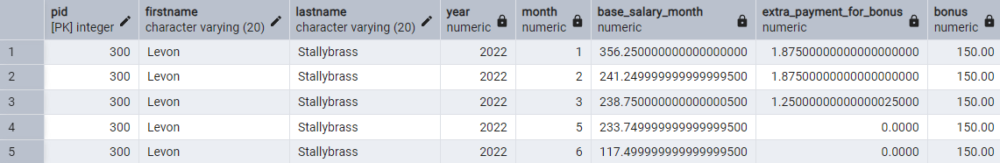


### שאילתא 4
**תיאור**: השירותים עבורם הוציאו הכי הרבה כסף
**הקוד** : 
```
with listoftotals as(select servicename , sum(price)as total
from serves

group by servicename)
select servicename as most_expensive_service,total 
from listoftotals
where total = (select max(total) from listoftotals)
```
**התוצאה** :  
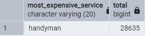

### שאילתא 5
**תיאור**: הספק הכי זול עבור כל שירות  
**הקוד** : 
```
select pid, firstname , lastname,servicename,price as cheapest_price
from serves as b natural join person
where price =(select min(price)
				from serves
				where servicename=b.servicename)
```
**התוצאה** :  
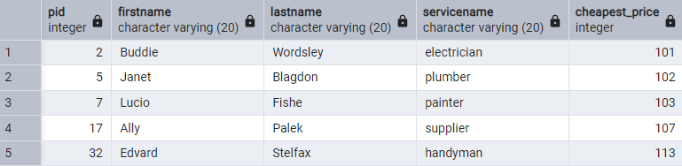

### שאילתא 6 
יכום שעות עבודה לכל תפקיד  –  חודש לדוגמה (מרץ 2022) 
**תיאור**:   
**הקוד** : 
```
WITH shift_hours AS (
    SELECT  w.job,
            s.pid,
            EXTRACT(EPOCH FROM (s.clock_out - s.clock_in))/3600 AS hrs
    FROM    shift   s
    JOIN    worker  w USING (pid)
    WHERE   extract(MONTH FROM date)  = 5 and extract(Year FROM date ) = 2022
)
SELECT  job                                           ,
        COUNT(DISTINCT pid)                        AS amount_of_workers,
        ROUND(SUM(hrs), 2)                         AS total_work_time,
        ROUND(SUM(hrs) / COUNT(DISTINCT pid), 2)   AS ave_hours_per_person
FROM    shift_hours
GROUP   BY job
ORDER   BY ROUND(SUM(hrs) / COUNT(DISTINCT pid), 2)  DESC;
```
**התוצאה** :  
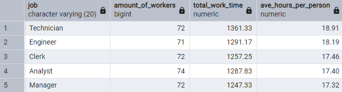

### שאילתא 7
**תיאור**: מראה את כמות העובדים מכל משרה מעל 65 (ככה תדע מי יוצא לפנסיה ולפי זה תעסיק עובדים חדשים)  
**הקוד** : 
```
with elderly_workers_per_job as (
		select job,sum(1) as amount_of_employees
		from person  join  worker on person.pid = worker.pid
		left outer join hourly on worker.pid = hourly.pid
		left outer join monthly on worker.pid = monthly.pid
		where dateofb < CURRENT_DATE - INTERVAL '65 year'
		group by job
),
select * 
from elderly_workers_per_job
```
**התוצאה** :  
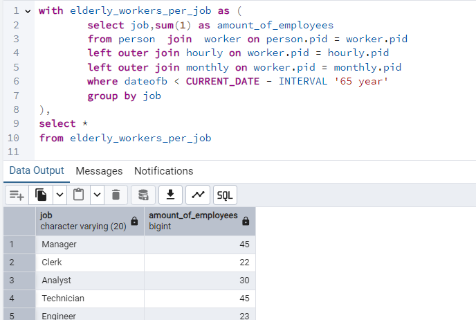  


### שאילתא 8
**תיאור**: השאילתא מראה את 10 העובדים עם חוזה שעתי שיש להם הכי הרבה אוברטיים יחסית לשעות עבודה רגילות  
**הקוד** : 
```
with overtime_percentage as(
			select pid,date,ROUND(LEAST(EXTRACT(EPOCH FROM (s.clock_out - s.clock_in)) / 3600,8),2)as basic,
			ROUND(GREATEST(EXTRACT(EPOCH FROM (s.clock_out - s.clock_in)) / 3600-8,0),2)as overtime
			from hourly h natural join shift s
			ORDER BY pid
), our_months_we_care_about as(
select *,Round(overtime/(basic+overtime),2)as overtime_proportion
from overtime_percentage
where extract(year from date)=2023 and extract(month from date)>=2)


select pid, sum(basic) as month_basic, 
			sum(overtime) as month_overtime,
			ROUND(sum(overtime)*100/sum(basic +overtime),6) as proportion_over_the_month
from our_months_we_care_about
group by pid
order by proportion_over_the_month desc LIMIT 100
```
**התוצאה** :  
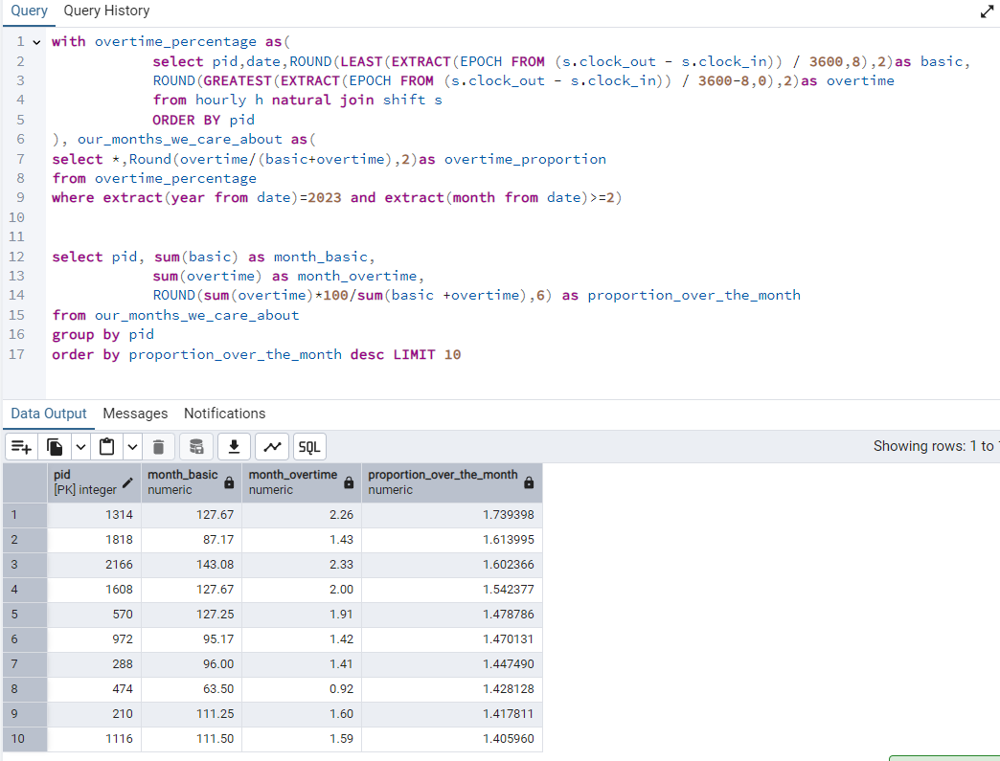
 


## שאילתות update

### שאילתת update 1 
**תיאור**: נותן עוד יום חופש למי שיש יותר מוותק מסוים  
**הקוד**: 
```
UPDATE monthly AS m
SET    vacationdays = vacationdays + 1
FROM   worker  w
WHERE  m.pid = w.pid
  AND  w.dateOfEployment <= CURRENT_DATE - INTERVAL '2 years'
RETURNING m.pid, m.vacationdays;
```

**לפני**    
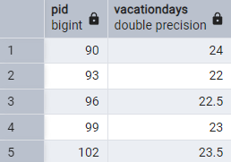  
**אחרי**  
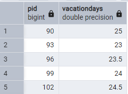


### שאילתת update 2 
**תיאור**:   עדכון נתוני שכר  
**הקוד**: 
```
UPDATE hourly
SET    salaryph = salaryph + 2.50,      
       bonus     = bonus + 250.00       
WHERE  pid = 102
RETURNING pid, salaryph, bonus;
```  
**לפני**    
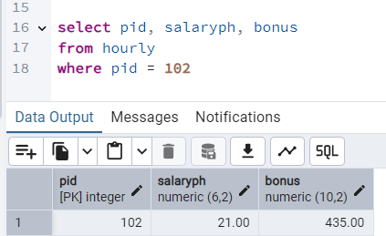  
**אחרי**    
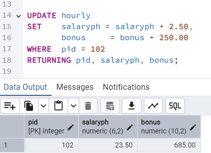


### שאילתת update 3 
**תיאור**:  מקפיץ את המשכורת של כל מי שעבד בחודש נתון ב5%  (5/2022)  
**הקוד**: 
```

UPDATE hourly AS h
SET    salaryph = ROUND(salaryph * 1.05, 2)          -- keep two decimals
FROM  (
        SELECT  pid,max(salaryph),max(date)as wert
        FROM    shift natural join hourly
        WHERE   extract(MONTH FROM date)=5 and extract(YEAR FROM date)= 2022
        GROUP BY pid
        HAVING  SUM(EXTRACT(EPOCH FROM (clock_out - clock_in)))/3600 > 16
      ) AS big_month
WHERE  h.pid = big_month.pid
RETURNING h.pid, salaryph;       
```
**(השאילתא לראות את מה שצריך לפני)**
```
select pid,salaryph
from hourly natural join shift
WHERE   extract(MONTH FROM date)=5 and extract(YEAR FROM date)= 2022
GROUP BY pid
HAVING  SUM(EXTRACT(EPOCH FROM (clock_out - clock_in)))/3600 > 16
order by pid
```


**לפני**    
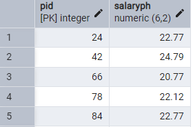   
 **אחרי**  
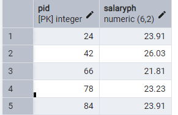


##  שאילתות delete  


### שאילתת delete 1   
**תיאור**:  -מוחק את כל הפרילנסרים שאין להם שום שירות רשום ב-serves        
**הקוד**:   
```
DELETE FROM freelance f
WHERE NOT EXISTS (
    SELECT 1
    FROM serves s
    WHERE s.pid = f.pid
      
);
```

**לפני**  
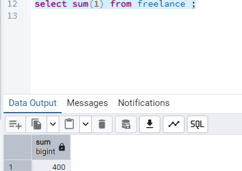    
**אחרי**    
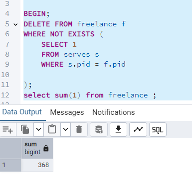  


### שאילתת delete 2  
**תיאור**: מוחק עובדים שלא נמצאים בחוזהה חודשי ולא בחוזה שנתי     
**הקוד**:   
```
DELETE FROM worker AS w
WHERE NOT EXISTS (SELECT 1 FROM hourly    h WHERE h.pid = w.pid)
  AND NOT EXISTS (SELECT 1 FROM monthly   m WHERE m.pid = w.pid);
```

**לפני**   
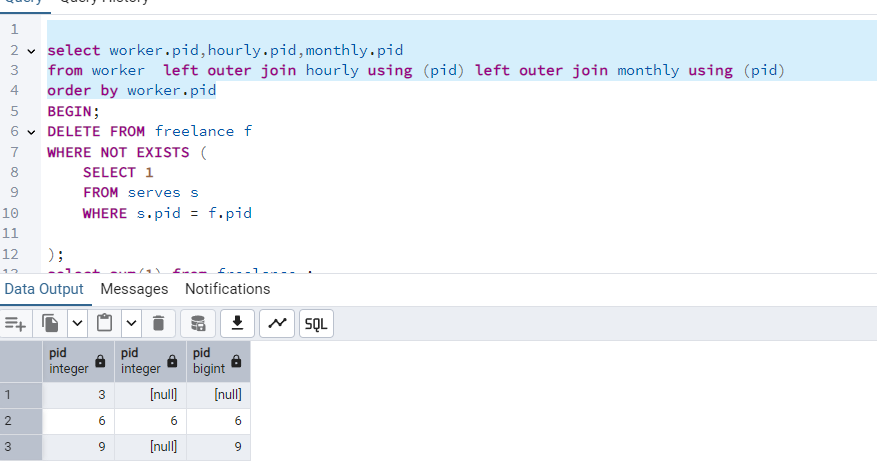 
**אחרי**    
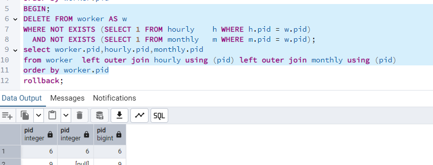   


### שאילתת delete 3   
**תיאור**:  מעיף כל משמרת שהיתה פחות משעה    
**הקוד**:   
```
DELETE FROM shift
WHERE EXTRACT(EPOCH FROM (clock_out - clock_in)) / 60 < 60;


```
**יעזור לראות**  
```
select *, EXTRACT(EPOCH FROM (clock_out - clock_in))/60 as minutes 
from shift order by EXTRACT(EPOCH FROM (clock_out - clock_in));

```
**לפני**   
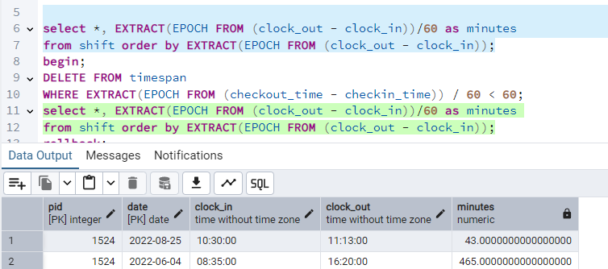   

**אחרי**    
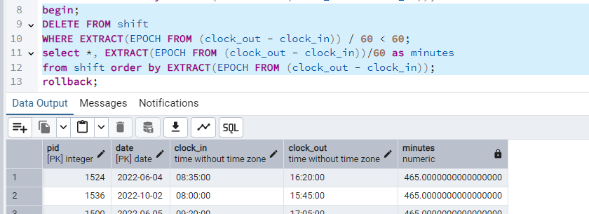  
  


## אילוצים

### אילוץ 1  
**תיאור:** מחייב שהמשכורות גדולות מ-0
  
**הקוד**  
```
ALTER TABLE hourly
ADD CONSTRAINT chk_hourly_salary_positive
CHECK (salaryph > 0);
```
**כישלון בעקבות האילוץ**  
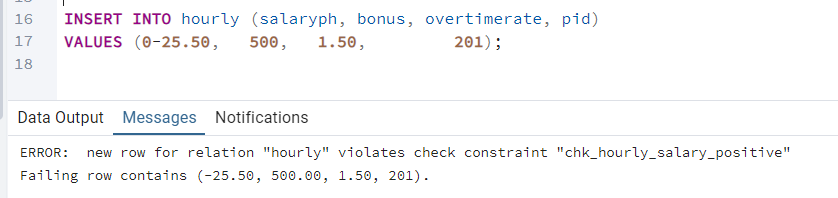


### אילוץ 2  
**תיאור:** מחייב שהכניסה תהיה לפני היציאה
  
**הקוד**  
```
ALTER TABLE shift
ADD CONSTRAINT chk_shift_time_order
CHECK (clock_in < clock_out);

```
**כישלון בעקבות האילוץ**  
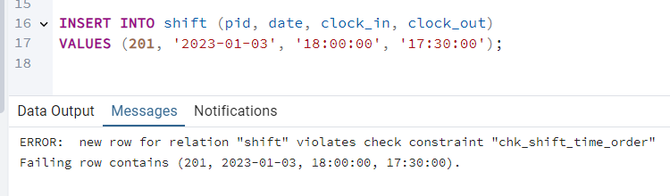

### אילוץ 3
**תיאור:** מחייב שמשמרת לא תהיה מדווחת על תאריך עתידי  

**הקוד**  
```
ALTER TABLE shift
ADD CONSTRAINT chk_shift_time_order
CHECK (clock_in < clock_out);

```
**כישלון בעקבות האילוץ**  
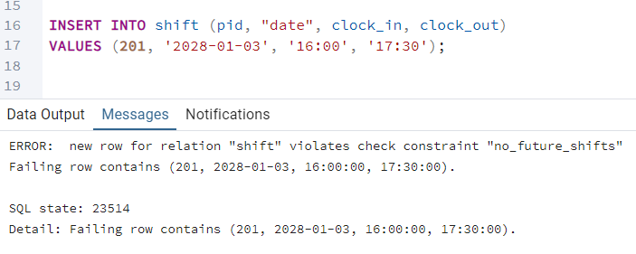


##  commit and rollback

### ראשון
**לפני מחיקת כל השירותים לפני 2022-07-10**  
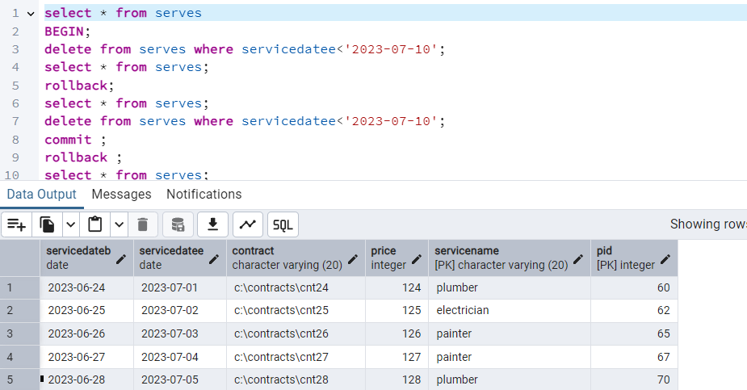  

**אחרי מחיקת כל השירותים לפני 2022-07-10**  
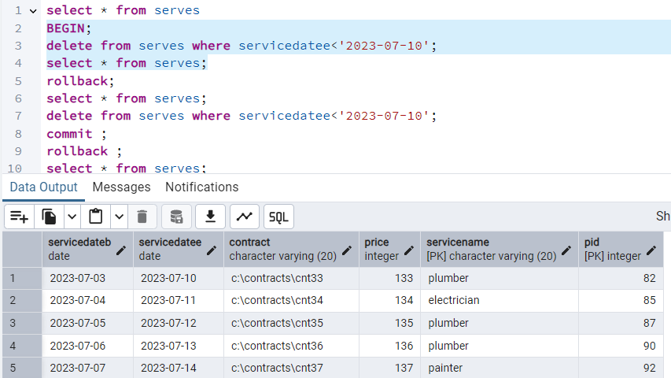  

**אחרי רולבק**  
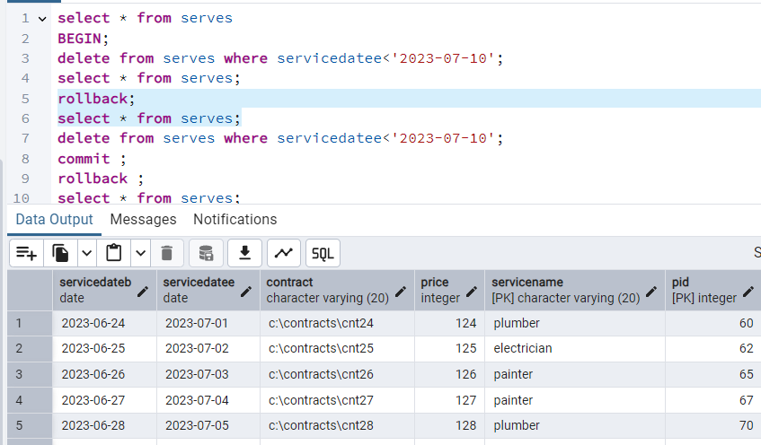  
**אחרי הרצת השאילתא שוב קומיט ואז רולבק**  
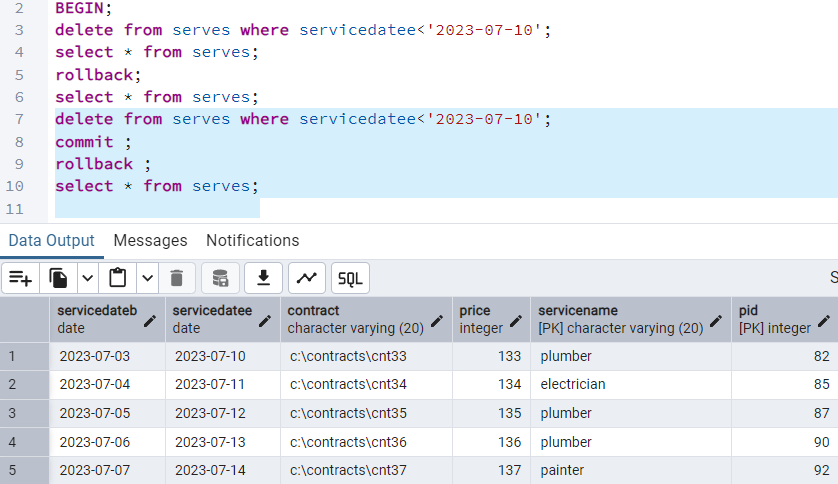  


## שני


**לפני הוספת עובד 4000**  
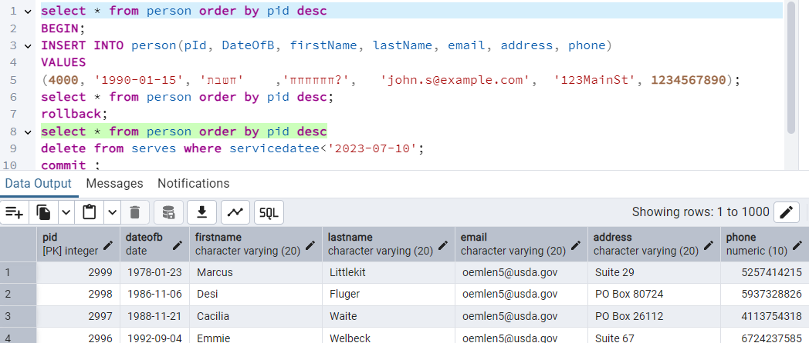  

**אחרי הוספת עובד 4000**  
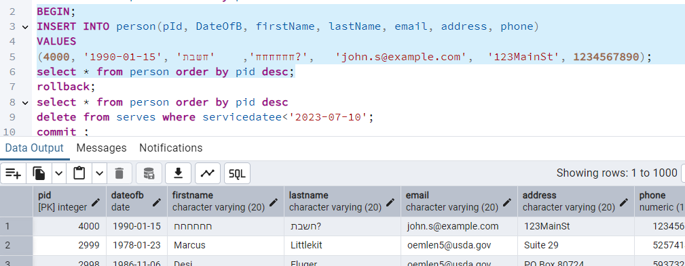   

**אחרי רולבק**  (חח יש בשורה אח"כ את השאילתא הקודמת שכחתי לשנות ל-insert )  
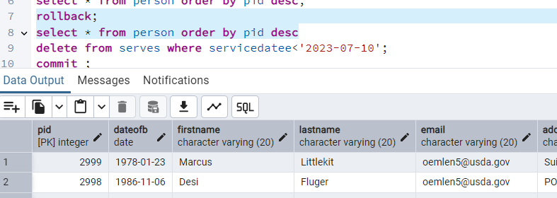    

**אחרי הרצת השאילתא שוב קומיט ואז רולבק**  
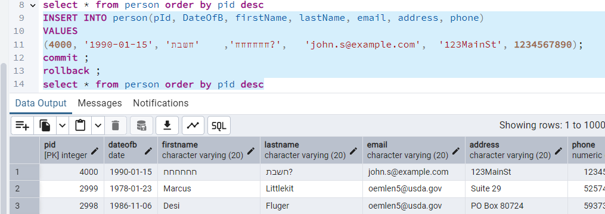  


### שלישי  

**לפני שקיצרתי את הכתובת**    
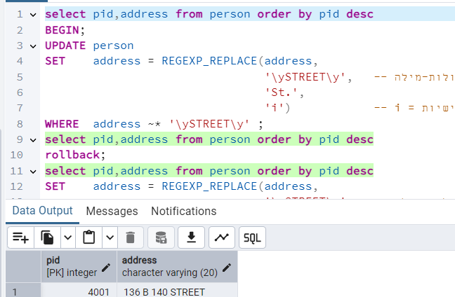  

**אחרי שקיצרתי את הכתובת**  
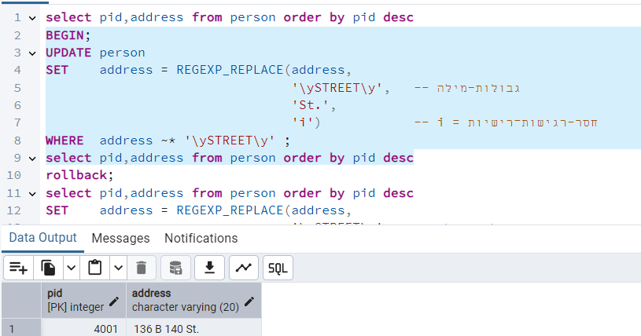  


**אחרי רולבק**  
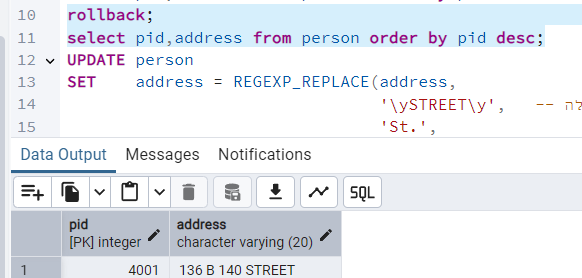  

**אחרי הרצת השאילתא שוב קומיט ואז רולבק**  
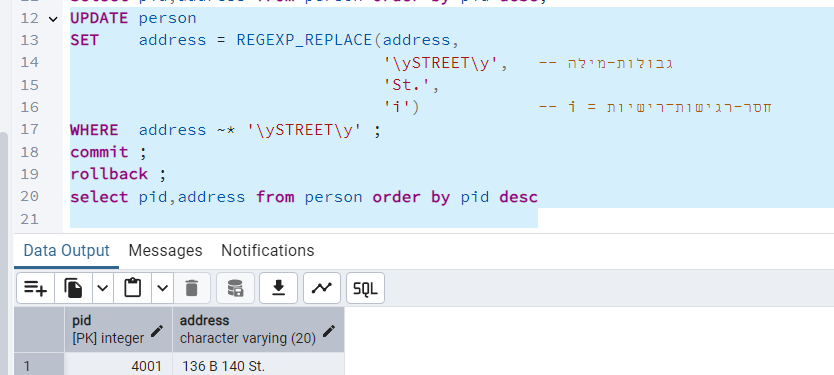
