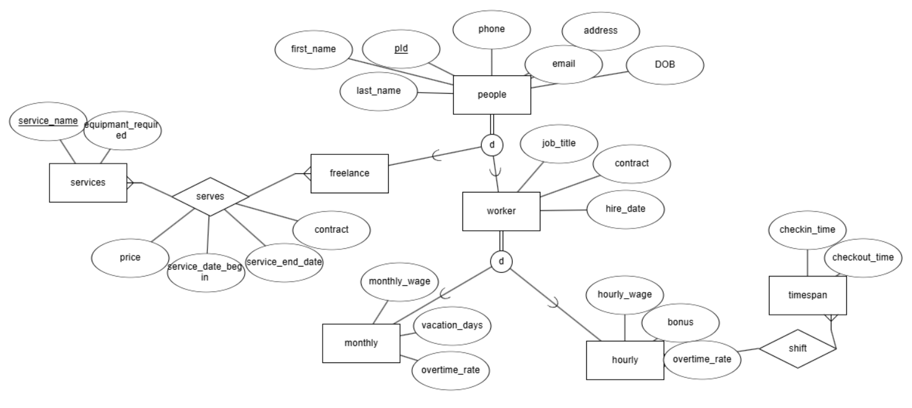
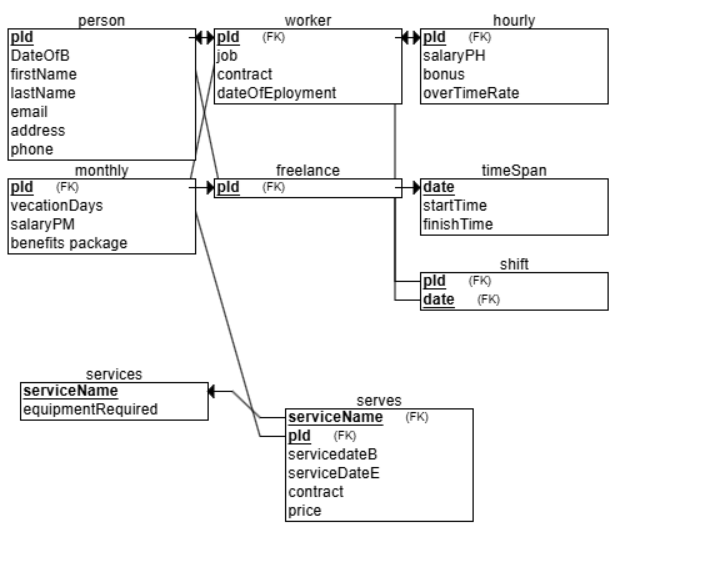

# DBProject_0939_2584
## moshe goodman 770120939  
## yehuda kuperman

### about the project

the project of the whole class is to run a gym chain
this subproject will be managing all the people within the system which would include all the data and access to the data of the people
the data includes personal data, and for the employees the data includes also salary, seniority, bunuses, contract, and profession/ job.

functionality should include hainvg customers signing up, buying memberships,(ordering gym time),ordering a certain teacher...
for the employee to update work hours and to take shifts
for the secretaries to manage customers (payment,membership,ordering time/teachers/class), employees (update salaries)
  class availability.........
for the manager same as secretary maybe also some more functionality.

person(**pId**,date of birth, first_name, last_name, email,address, phone)  
* freelance(**pId**)  
    * worker(**pId**,job_title,contract,hire_date)  
        * hourly(**pId**,Hourly_wage,bonus,overtime_rate)  
        * monthly(**pId**,vacation_days,monthly_wage,benefits_package)  
* timespan(**date**,checkin_time,checkout_time)  
* services(**service_name**,equipmant_required)

* shift(**pid**,**date**)  
* serves(service_nme,pId, service_date_begin,service_date_complete,contract,price)
 
maybe it is better to combine the shift and timespan into one table (put into consideration whether you want to have workers clock in twice for the same time)  
  
  
